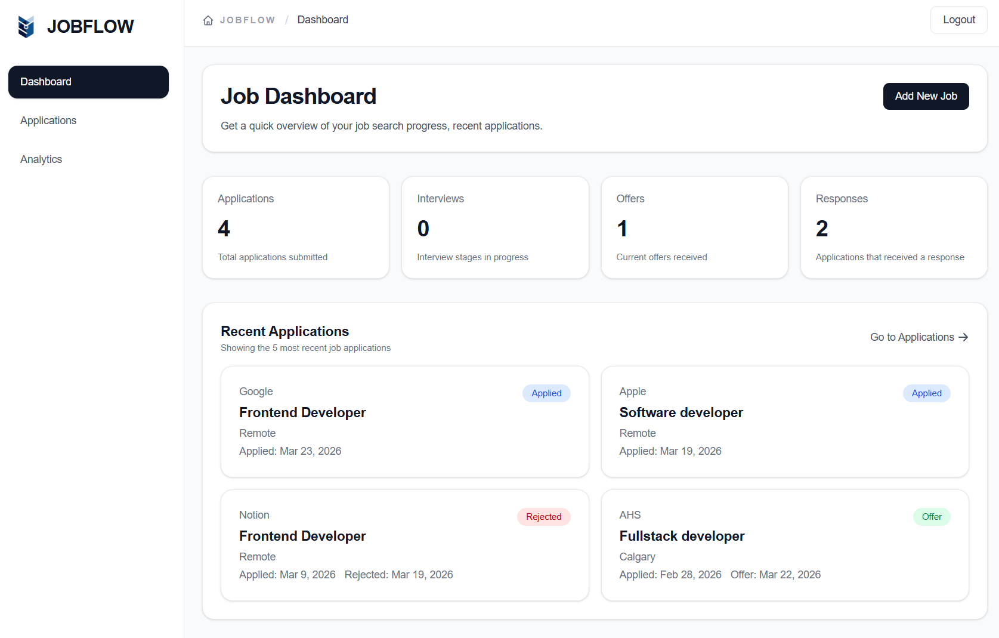
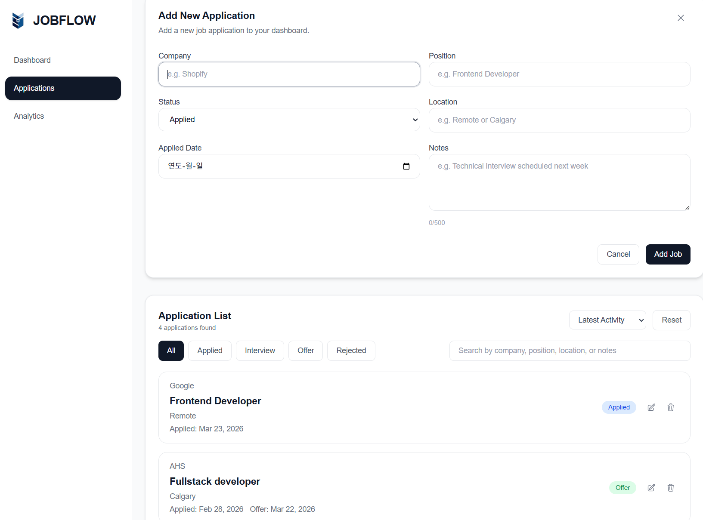
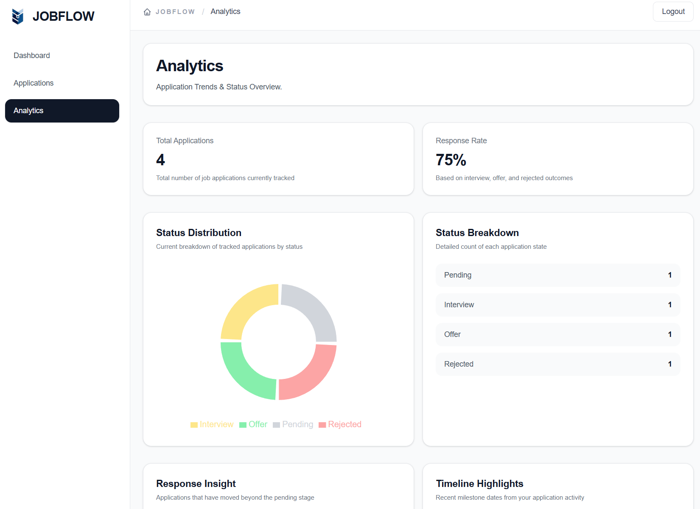

# JobFlow

A full-stack job application tracking system built with React, Node.js, Express, and MongoDB.

JobFlow allows users to manage their job search efficiently with authentication, user-specific data, and a clean dashboard experience.

---

## 🔍 Overview

JobFlow is designed to simulate a production-like job tracking product where users can:

- create and manage job applications
- track progress across different application stages
- view analytics such as response count and response rate
- securely access only their own job data

This project focuses on building a realistic full-stack application with authentication, REST API integration, database persistence, and thoughtful UI/UX decisions.

---

## ✨ Features

### 🔐 Authentication & Security

- JWT-based registration and login
- protected routes on both frontend and backend
- user-specific data isolation
- token-based authenticated API requests
- password visibility toggle on auth forms

---

### 📊 Dashboard

<p align="center">
  
</p>

- application summary cards
- response tracking overview
- recent applications preview
- clean empty states for new users

---

### 📁 Applications Management

<p align="center">
  
</p>

- add, edit, and delete job applications
- status tracking (`Applied`, `Interview`, `Offer`, `Rejected`)
- search by company, position, and notes
- filter and sort functionality
- notes field for storing extra job-related context
- form validation and status-based date handling

---

### 📈 Analytics

<p align="center">
  
</p>

- application breakdown by status
- response count and response rate
- derived analytics based on stored application data

---

### 🎯 UX / UI

- responsive dashboard layout
- reusable component-based architecture
- consistent grayscale visual hierarchy
- status-based color indicators
- safe handling of missing data
- mobile sidebar support

---

## 🛠 Tech Stack

### Frontend

- React
- Vite
- Tailwind CSS
- React Router DOM
- Recharts
- React Icons

### Backend

- Node.js
- Express

### Database

- MongoDB Atlas

### Authentication

- JSON Web Token (JWT)
- bcryptjs

### Deployment

- Vercel (frontend)
- Render (backend)

---

## 📁 Project Structure

```bash
job-dashboard/
  server/
    src/
      models/
      routes/
      middleware/
      server.js

  src/
    components/
      auth/
      dashboard/
      jobs/
      layout/
    hooks/
    pages/
    services/
    utils/
    App.jsx
    main.jsx
```

---

## 🧠 Key Implementation Details

### 1. Authentication

- JWT-based login and registration
- token stored in localStorage
- protected routes (frontend + backend)
- backend middleware verifies token

### 2. User Data Isolation

- each job linked to authenticated user
- queries filtered by `userId`
- prevents cross-user data access

### 3. Custom Hooks

- `useJobs` → CRUD + API integration
- `useApplicationFilters` → search, filter, sort
- `useJobForm` → form state and validation

### 4. Analytics

- total applications, interviews, offers, rejections
- response count and response rate
- latest activity tracking

### 5. UI/UX

- clean grayscale UI with clear hierarchy
- status-based color indicators
- responsive layout with sidebar navigation
- empty states for new users
- notes support for tracking details

---

## 🚀 How to Use

👉 Live Demo: https://jobflow-steel-five.vercel.app

1. Open the live demo link
2. Create an account
3. Log in with your account
4. Start adding and managing your job applications

---

## ▶️ Getting Started

### 1. Clone the repository

Frontend

```bash
git clone https://github.com/Joy-Juyoung/jobflow.git
cd jobflow
```

### 2. Install dependencies

Frontend:

```bash
npm install
```

Backend:

```bash
cd server
npm install
```

### 3. Setup environment variables

Create a `.env` file inside the `/server` directory:

```bash
MONGO_URI=your_mongodb_connection
JWT_SECRET=your_secret_key
PORT=5000
CLIENT_URL=http://localhost:5173
```

### 4. Run the application

Backend

```bash
cd server
npm run dev
```

Frontend

```bash
npm run dev
```

### 5. Open in **browser**

```bash
http://localhost:5173
```

```md
You can create a new account using the registration page.
```

---

## 🌐 Deployment

- Frontend: https://jobflow-steel-five.vercel.app
- Backend: https://jobflow-backend-889f.onrender.com

The backend includes a health check endpoint at `/api/health`.

> If this is your first time using the app, register a new account and log in to start tracking your applications.

---

## 📡 API Overview

### Auth

- `POST /api/auth/register`
- `POST /api/auth/login`

### Jobs

- `GET /api/jobs`
- `POST /api/jobs`
- `PATCH /api/jobs/:id`
- `DELETE /api/jobs/:id`

All `/api/jobs` routes require a valid JWT token.

---

## 📌 Future Improvements

- refresh token / improved auth persistence
- delete confirmation modal
- pagination for larger datasets
- improved error feedback UI
- further mobile UX refinements

---

## 👤 Author

Juyoung Lee (Joy)

GitHub: https://github.com/Joy-Juyoung
